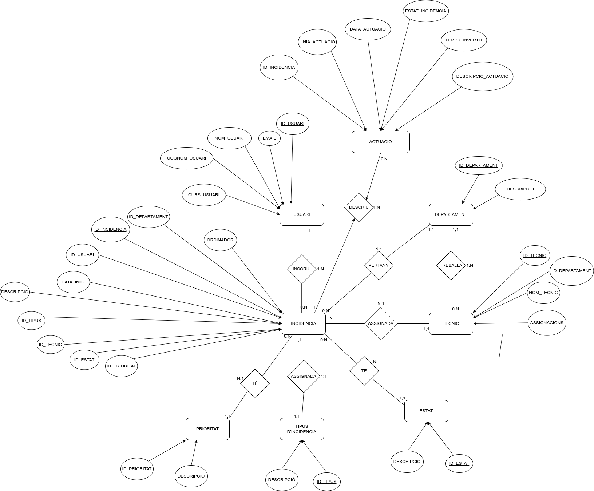

# README del Projecte Biel & Amin

Aquest és el nostre README, on es troben els nostres diagrames de casos d'ús, el model entitat-relació i el manual dús de l'usuari.
  

## GESTIÓ D'INCIDÈNCIES BIEL & AMIN DIAGRAMA DE CASOS D'ÚS
Aquest és el nostre diagrama de casos d'ús per al projecte. Representa les funcionalitats clau i com interactuen els diferents actors amb el sistema.
- Aquesta aplicació web té com a objectiu millorar la gestió i resolució d'incidències tècniques dins d'una organització. Els usuaris poden registrar incidències, consultar-ne l'estat i seguir el seu progrés fins a la resolució. L'aplicació també proporciona eines per als tècnics i administradors, que poden gestionar les incidències i consultar informes detallats.

## FUNCIONALITATS PRINCIPALS:

1. **Per a Usuari General** es registrarà una nova incidència i es consultarà l'estat de la incidència.

2. **Per a Tècnic** es veurà les incidències assignades, registrar l'actuació i es tancarà la incidència.

3. **I per Administrador** es modificarà la incidència, es consultarà informes i es consultarà les estadístiques d'accés.

- 

## MODEL ENTITAT-RELACIÓ

El model entitat-relació mostra com s'estructuren i com es relacionen les diferents entitats dins del nostre sistema de recopilació d'incidències.

- **Usuari**: Persona que pot crear o veure incidències.  
- **Incidència**: És el problema a tractar.  
- **Prioritat**: Depenent de quin tipus d'incidència es tracti (depenent del que l'usuari introdueixi en el formulari).  
- **Tipus d'incidència**: Segons la descripció de l'usuari, la incidència serà d'un tipus o d'un altre (de software, el ratolí, el teclat, etc.)  
- **Estat**: Aquesta entitat fa referència a l'estat en el qual es troba la incidència.  
- **Tècnic**: Persona encarregada de resoldre incidències.  
- **Departament**: Cada incidència té associat un departament.  
- **Actuació**: Els tècnics, cada cop que arreglin o avancin en resoldre una incidència, ho faran mitjançant aquesta entitat.  

*A continuació mostrem el diagrama que representa aquestes entitat i les seves relacions i atributs.*

