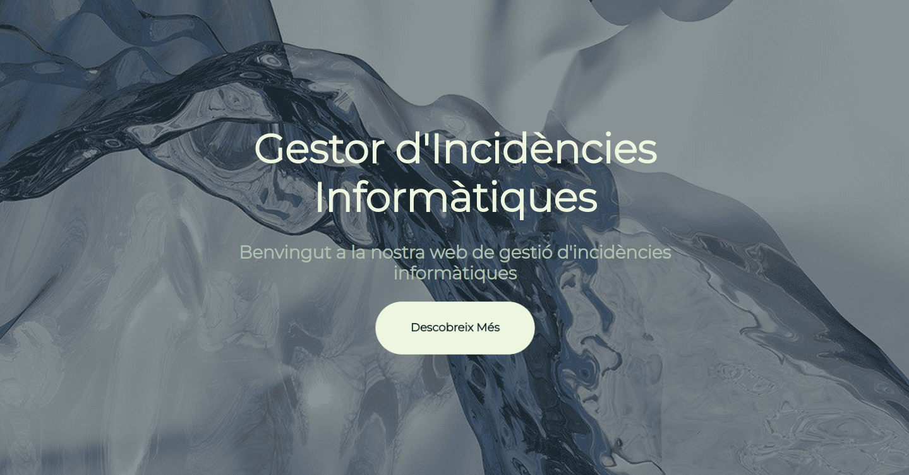
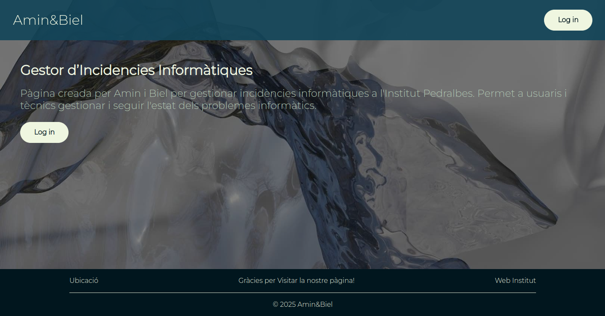
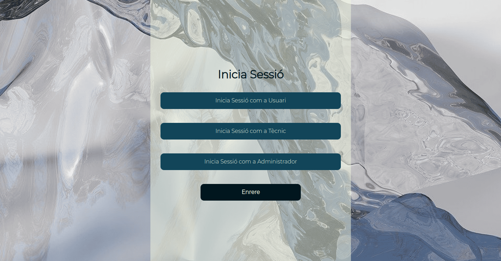
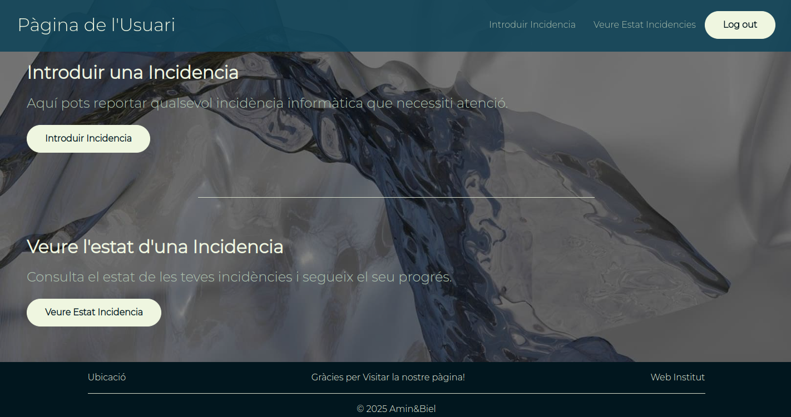
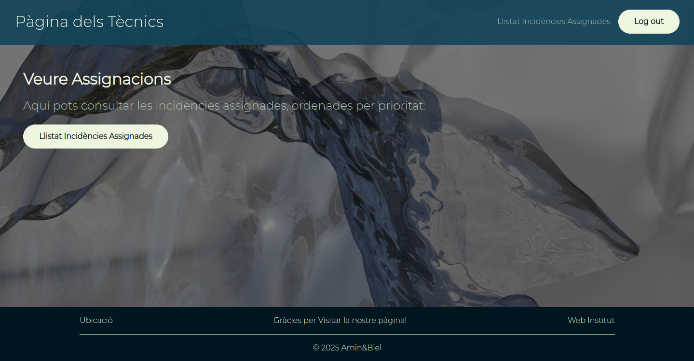
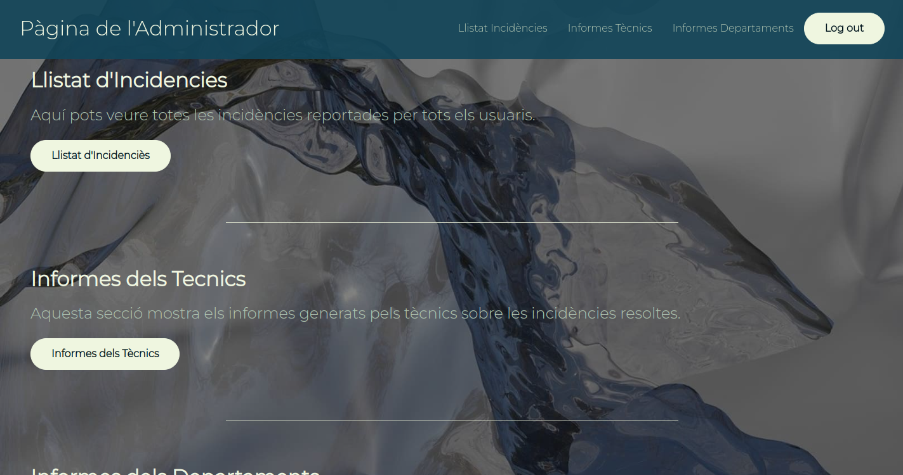

# USER MANUAL
Welcome to the User Manual of the IT Issue Manager of Institut Pedralbes.

This app is made by Amin and Biel, and in these manual we are going to explain how the website works and the specific functions for each type of user (user, technician, and admin).

## ACCESS TO THE WEBSITE
When you enter our website, you will see the landing page. In the middle of the app, there is a button to access the main website.

## FIRST PAGE
Once you are on the first page, you will find a brief explanation about the website and a login button to enter the app based on your role.

## USER PAGE: How to Report an IT Issue
There are 2 main functions on this page:
- **Report an IT Issue:**
 By choosing this option, you will be redirected to a form. Fill in the required fields to report your issue (department name, problem description, who you are, etc.).

- **Follow all your reports:**
 After making a report, you will need to provide your email address. This will allow you to track the progress of your reports, such as the status of the issue and how many times technicians have worked on it.

## TECHNICIAN PAGE: How to Manage Assignments
On the technician page, there is 1 main function:
- **See all your assignments:**
 To see your assignments, enter your technician ID (the one provided by the school). The page will display all your assignments, sorted by priority.
 If you want to close a report or report an action, there is a button that redirects you to a form. In this form, you will need to describe the action taken, the time spent on it, and whether the issue is resolved or still ongoing.

## ADMIN PAGE: Managing Reports and Assignments
The admin page has 4 main functions:
- **See all the reports:**
 Here, you can view all the reports and their details, including which technician is responsible, the department, and more. You can also edit reports. Specifically, you can change the assigned technician, set or change the priority, and define the type of issue (e.g., mouse, monitor, software, etc.).

- **See all the actions of the technical team:**
 On this page, you can view the actions performed by each technician.

- **See the total number of reports and actions per department:**
 This page provides statistics about the number of issues reported by each department.

- **See the Total Number of Logs per Page:**
    This page shows you all the statistics and information about how each type of user interacts with the pages of the website.
    You will be able to see the type of user, their IP address, and the exact date and time when the interaction happened.

